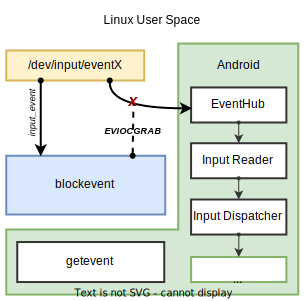

# blockevent for Android

[](https://github.com/nmelihsensoy/blockevent/actions?query=workflow%3Arelease)
[](https://github.com/nmelihsensoy/blockevent/releases/latest)
[](LICENSE)

> *The "Android" name is a trademark of Google LLC.*



`blockevent` runs on the `user space` similarly to [`getevent`](https://source.android.com/devices/input/getevent) tool.

It grabs exclusive input handle with using [`EVIOCGRAB`](https://github.com/torvalds/linux/blob/5bfc75d92efd494db37f5c4c173d3639d4772966/include/uapi/linux/input.h#L183) control for input devices in the `/dev/input/` to block [`input_event`](https://github.com/torvalds/linux/blob/169387e2aa291a4e3cb856053730fe99d6cec06f/include/uapi/linux/input.h#L28) flow to Android Platform's [`EventHub`](https://cs.android.com/android/platform/superproject/+/master:frameworks/native/services/inputflinger/reader/EventHub.cpp;l=672?q=EventHub&ss=android%2Fplatform%2Fsuperproject).

Then releases the devices when specified `input_event` is received from any device or [`SIGINT`](https://en.wikipedia.org/wiki/Signal_(IPC)#SIGINT) signal sent by its terminal.

<br clear="left"/>

---

Can be used:

- To keep using devices that has faulty touch screen(especially ghost touch), buttons or headphone jack without modifying the kernel or disassembly any hardware.

- For the applications needing to temporarily block of touch screen such as video players, child locks, drawing tracers.

- For the applications needing to permanently block of touch screen like turning device into display.

## Usage

```
Usage: blockevent [-b] [input device]
                : run as normal. To stop use 'CTRL+C' or 'pkill -2 blockevent'
              -b: run as a background job. To stop use 'kill "%$(pgrep blockevent)"'
              -h: print help.
    input device: '/dev/input/eventX' find X with using getevent tool.
```

Get your executable binary from [Releases](https://github.com/nmelihsensoy/blockevent/releases) or build yourself then follow the commands.

Running on device :

```
su # or tsu
cp blockevent_xxx /data/local/tmp/
chmod +x /data/local/tmp/blockevent_xxx
./data/local/tmp/blockevent_xxx
```

Running with adb :

```
adb push blockevent_xxx /data/local/tmp/
adb shell su -c "chmod +x /data/local/tmp/blockevent_xxx"
adb shell su -c /data/local/tmp/blockevent_xxx
```

Example usage :

```console
> getevent -lp
add device 3: /dev/input/event6
  name:     "atoll-wcd937x-snd-card Headset Jack"
  ...

> ./data/local/tmp/blockevent_xxx /dev/input/event6
```

## Build

| Target | ABI |
| --- | ----------- |
| `android_arm` | armeabi-v7a |
| `android_arm64` | arm64-v8a |
| `android_x86` | x86 |
| `android_x86_64` | x86_64 |

There is a script provided to build application for all the targets. Make sure you download NDK and install Bazel then follow the commands.

Using the `release.sh` script:

```console
> export ANDROID_NDK_HOME=/YOUR/NDK/PATH
> ./release.sh

4 build completed successfully (Total: 4)
releases/blockevent_arm: ELF 32-bit LSB executable, ARM, EABI5 version 1 (SYSV), dynamically linked, interpreter /system/bin/linker, with debug_info, not stripped
...
```

Build for the specific target:

```
bazel build //src:blockevent --config=TARGET
```

## TODO

- [ ] Add specific event trigger option to stop blocking
- [ ] Add touch device classifier to able to block touchscreen without getting device from the user.
- [ ] Add option to block multiple devices at the same time.
- [ ] Add installation script
- [ ] Add option to block only specific part of touchscreen 
